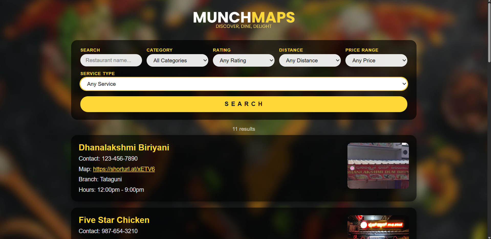

# Munch Maps

3rd year DBMS mini project from Jyothy Institute of Technology (VTU, Bangalore). Built to find restaurants near the college campus. I cleaned it up after submission and added a few things like search, live filters, and env variables for the DB config.


*Filter by category, rating, distance, price, and service type. Results update live and show a count.*

This was a 5th-semester mini-project at Jyothy Institute of Technology (VTU), built while learning database design, SQL, and how to wire up a basic filtering system over a relational schema. The restaurant data is a small set from my local area at the time, so it works as a demo of those concepts but it is not a real-world product. I came back to it later to fix some security issues, clean up the code structure, and tidy a few things, but the scope is still that of the original student project.

## What it does

Filter restaurants by category, rating, distance, price range, and service type. There's a name search too. Filters update live as you change them.

Distance is stored as a bucket (nearby / moderate / far) relative to the college, not real GPS coordinates, so there's no actual distance sorting.

## Stack

Node.js + Express, MySQL 8, plain HTML/CSS/JS.

## Database setup

You need Node 18+ and MySQL 8.

Create the database first:

```sql
CREATE DATABASE munch_maps;
USE munch_maps;
```

Then run the files in `database/` in this order:

```text
category.sql
rating.sql
distance.sql
price.sql
service.sql
restaurant.sql
```

If you already had the database set up before the ImageFile column was added, run `database/migrate_add_imagefile.sql` to add it.

## Running it

Clone and install:

```bash
git clone https://github.com/achalnm/MunchMaps.git
cd MunchMaps
npm install
```

Copy `.env.example` to `.env` and fill in your MySQL password:

```text
DB_HOST=localhost
DB_USER=root
DB_PASSWORD=yourpassword
DB_NAME=munch_maps
PORT=3000
```

Start:

```bash
npm start
```

Open `http://localhost:3000`. Use `npm run dev` if you want auto-restart while editing.

## Made by

- Achal N ([GitHub](https://github.com/achalnm), [LinkedIn](https://www.linkedin.com/in/achal-n-35153821b))
- Pujitha DR ([GitHub](https://github.com/pujitha2712), [LinkedIn](https://www.linkedin.com/in/pujitha-ramesh-937986228))
- Navaneet R Rao ([GitHub](https://github.com/navaneet-rao), [LinkedIn](https://www.linkedin.com/in/navaneet-r-rao/))
